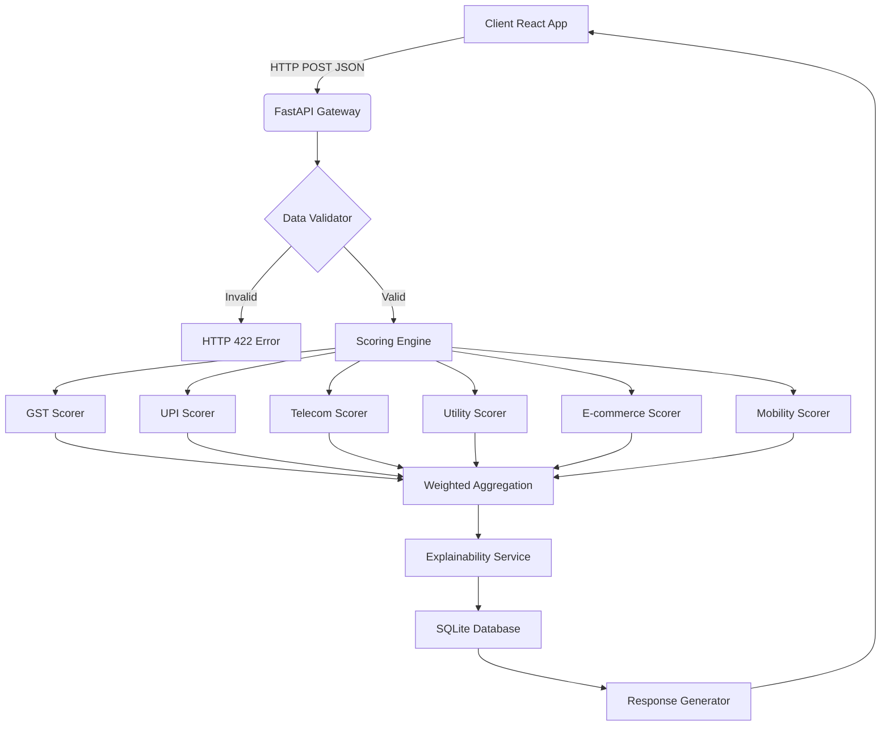

# TVS Credit EPIC 8 Hackathon: Alternative Data Credit Engine

## Problem Statement
The objective of this project is to build an AI-powered alternative credit scoring engine. Traditional credit scoring relies heavily on credit bureau histories (like CIBIL), which excludes a massive segment of the population, including first-time borrowers, gig workers, small merchants, and informal sector workers. 

This engine solves this problem by leveraging alternative data points—such as GST filings, UPI transaction trends, telecom recharge patterns, utility bill payments, e-commerce activity, and mobility/vehicle usage patterns—to generate deterministic, explainable risk scores.

## Key Features

* **Multi-Source Alternative Data Integration:** Processes 6 disparate data sources (GST, UPI, Telecom, Utility, E-commerce, Mobility).
* **Deterministic Rule-Based Scoring:** Transparent, explainable, and fully deterministic risk scoring logic mapped from 0-100.
* **Explainable AI (XAI) Output:** Generates human-readable summaries and categorizes risk factors (positive/negative/neutral) dynamically.
* **Dynamic Weighting:** Calculates overall risk based on a weighted average tailored for gig and informal sectors.
* **Comprehensive API:** FastAPI backend with robust Pydantic validation and comprehensive endpoints.
* **Responsive Dashboard:** React/Vite frontend with an interactive multi-step application form and animated visual gauges.

## Architecture



## Technology Stack

* **Backend:** Python 3.11+, FastAPI, SQLAlchemy, Pydantic, Pytest (100% test pass rate)
* **Frontend:** React 18, Vite, React Router, Custom CSS (No Tailwind)
* **Infrastructure:** Docker, Docker Compose, GitHub Actions (CI/CD)

## Alternative Scoring Algorithm

The engine calculates risk deterministically using the following weighted data sources. If a data source is completely missing, the engine dynamically redistributes the weight proportionally to the remaining provided data sources.

* **UPI Data (30%):** Evaluates transaction velocity, volume, and consistency over active months.
* **GST Data (25%):** Assesses business health via annual turnover thresholds and filing consistency. High-risk business types receive dynamic penalties.
* **Telecom Data (15%):** Calculates financial discipline through monthly recharge amounts and historical consistency.
* **Utility Data (15%):** Weighs bill payment timeliness and historical track records.
* **E-commerce Data (10%):** Analyzes purchase frequency and penalizes high return rates (which indicate cashflow instability).
* **Mobility Data (5%):** Adds supplementary confidence based on vehicle ownership and fuel expense tracking.

## Setup & Installation

### Option 1: Docker Compose (Recommended)

1. Ensure you have Docker and Docker Compose installed.
2. Clone the repository and run:
    ```bash
    docker compose up --build
    ```
3. Access the applications:
    * **Frontend Dashboard:** `http://localhost:80`
    * **Backend API Docs (Swagger):** `http://localhost:8000/docs`

### Option 2: Local Development Setup

**Backend:**
```bash
cd backend
python -m venv venv
source venv/bin/activate  # On Windows: venv\Scripts\activate
pip install -r requirements.txt
uvicorn app.main:app --reload --port 8000
```

**Frontend:**
```bash
cd frontend
npm install
npm run dev
```

## Testing

The backend includes a comprehensive test suite covering all scoring rules, business logic, and API endpoints.

```bash
cd backend
source venv/bin/activate
PYTHONPATH=. python -m pytest tests/ -v --cov=app --cov-report=xml
```

## API Endpoints

| Method | Endpoint | Description |
| :--- | :--- | :--- |
| `GET` | `/api/v1/health` | System health check |
| `POST` | `/api/v1/credit/score` | Submit application & calculate score |
| `GET` | `/api/v1/credit/score/{id}` | Retrieve specific credit score by ID |
| `GET` | `/api/v1/credit/customer/{id}/scores` | Get all scores for a customer |
| `POST` | `/api/v1/credit/compare` | Compare two customers' scores |
| `GET` | `/api/v1/credit/mock-customers` | Fetch 10 diverse mock profiles for testing |
