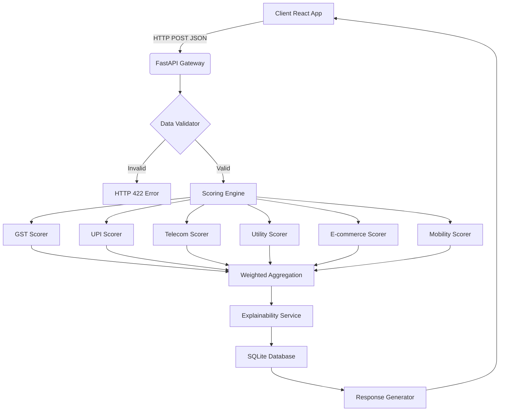

# TVS Credit EPIC 8 Hackathon: Alternative Data Credit Engine

## Problem Statement

Traditional credit scoring relies heavily on credit bureau histories (like CIBIL), which excludes a massive segment of the population -- over 400 million Indians including first-time borrowers, gig workers, small merchants, and informal sector workers who have no formal credit file.

This engine solves the problem by leveraging alternative data points -- GST filings, UPI transaction trends, telecom recharge patterns, utility bill payments, e-commerce activity, and mobility/vehicle usage patterns -- to generate deterministic, explainable risk scores.

## Key Features

* **Multi-Source Alternative Data Integration:** Processes 6 disparate data sources (GST, UPI, Telecom, Utility, E-commerce, Mobility).
* **Deterministic Rule-Based Scoring:** Transparent, explainable, and fully deterministic risk scoring logic mapped from 0-100. No black-box ML models.
* **Explainable AI (XAI) Output:** Generates human-readable summaries and categorizes risk factors (positive/negative/neutral) dynamically.
* **Visual Risk Signature (Radar Charts):** Interactive visualization of a borrower's risk profile across all 6 sectors using Recharts.
* **Side-by-Side Applicant Comparison:** Dedicated UI to compare the risk profiles of two applicants simultaneously with overlayed radar charts.
* **Exportable Credit Reports:** One-click PDF generation of the complete credit assessment and XAI breakdown.
* **Dynamic Weighting:** Calculates overall risk based on a weighted average tailored for gig and informal sectors.
* **Comprehensive API:** FastAPI backend with robust Pydantic validation, 7 endpoints, and auto-generated Swagger docs.
* **Responsive Dashboard:** React/Vite frontend with an interactive multi-step application form and animated visual gauges.

## Architecture



## Technology Stack

* **Backend:** Python 3.11+, FastAPI, SQLAlchemy, Pydantic, Pytest (83 tests, 100% pass rate)
* **Frontend:** React 18, Vite, React Router, Recharts, Custom CSS Design System
* **Infrastructure:** Docker, Docker Compose, GitHub Actions CI/CD
* **Database:** SQLite (development), PostgreSQL-ready (production)

## Scoring Components

| Source | Weight | Data Points |
|---|---|---|
| GST | 20% | Turnover, filing consistency, months filed, business type |
| UPI | 20% | Transaction volume, frequency, duration, average size |
| Telecom | 15% | Recharge amount, consistency, history length |
| Utility | 15% | Bill amount, payment timeliness, history length |
| E-commerce | 15% | Purchase frequency, return rate, order value, duration |
| Mobility | 15% | Vehicle ownership, fuel expense, tracking duration, vehicle type |

For a detailed walkthrough of the scoring algorithm with worked examples, see [Algorithm Explanation](./docs/ALGORITHM_EXPLANATION.md).

## Setup and Installation

### Option 1: Docker Compose (Recommended)

```bash
git clone https://github.com/ananyaapoorva/tvs-credit-engine.git
cd tvs-credit-engine
docker compose up --build
```

Access the applications:
* **Frontend Dashboard:** http://localhost:80
* **Backend API Docs (Swagger):** http://localhost:8000/docs

### Option 2: Local Development

**Backend:**
```bash
cd backend
python -m venv venv
source venv/bin/activate  # On Windows: venv\Scripts\activate
pip install -r requirements.txt
uvicorn app.main:app --reload --port 8000
```

**Frontend:**
```bash
cd frontend
npm install
npm run dev
```

## Testing

The backend includes a comprehensive test suite (103 tests) covering all scoring rules, business logic, null-data robustness, API endpoints, and the command-line interface.

```bash
cd backend
source venv/bin/activate
PYTHONPATH=. python -m pytest tests/ -v --cov=app
```

## Command-Line Interface

The engine ships a headless CLI, `tvs-credit`, that scores an application JSON file through the exact same services the API uses -- no server or database required. This is useful for lending pipelines, batch scoring, and CI smoke checks.

```bash
# Install from source
pip install -e "./backend[dev]"

# Human-readable report
tvs-credit application.json

# Machine-readable JSON (pipeable -- only the JSON goes to stdout)
tvs-credit --json application.json | jq .overall_risk_score

# Version
tvs-credit --version
```

The application file follows the same shape as the `POST /api/v1/credit/score` body. Any data source may be omitted or set to `null` (e.g. an informal-sector applicant with no GST history) -- it is scored as `0` and explained as "no data provided", exactly matching the API.

## API Endpoints

| Method | Endpoint | Description |
| :--- | :--- | :--- |
| `GET` | `/api/v1/health` | System health check |
| `POST` | `/api/v1/credit/score` | Submit application and calculate score |
| `GET` | `/api/v1/credit/score/{id}` | Retrieve specific credit score by ID |
| `GET` | `/api/v1/credit/customer/{id}/scores` | Get all scores for a customer |
| `GET` | `/api/v1/credit/customers` | Fetch recent customers for comparison |
| `POST` | `/api/v1/credit/compare` | Compare two customers' scores |
| `GET` | `/api/v1/credit/mock-customers` | Fetch 10 diverse mock profiles for testing |

For full request/response examples, see [API Documentation](./docs/API_DOCUMENTATION.md).

## Project Structure

```
tvs-credit-engine/
|-- backend/
|   |-- app/
|   |   |-- models/          # SQLAlchemy ORM models (Customer, CreditScore, Transaction)
|   |   |-- schemas/         # Pydantic request/response schemas
|   |-- services/        # Scoring engine, explainability, data validation
|   |-- routers/         # FastAPI route handlers
|   |-- utils/           # Constants, mock data generator
|   |-- database.py      # Database connection and session management
|   |-- config.py        # Environment configuration
|   +-- main.py          # FastAPI application entry point
|-- backend/cli.py           # Headless tvs-credit CLI (no server needed)
|-- backend/pyproject.toml   # Packaging + console script
|-- backend/tests/           # 103 unit and integration tests
|-- frontend/
|   |-- src/
|   |   |-- components/      # ApplicationForm, ResultsDashboard, RiskGauge, ExplainabilityCard, TransactionHistory
|   |   |-- pages/           # Dashboard, Results, CompareApplicants
|   |   |-- services/        # API client (api.js)
|   |   |-- App.jsx          # Router and layout
|   |   +-- index.css        # Complete CSS design system
|   +-- package.json
|-- docs/                    # API docs, Algorithm explanation, Deployment guide
|-- .github/workflows/      # CI/CD pipeline (backend tests, frontend build, Docker build)
|-- docker-compose.yml
|-- CONTRIBUTING.md
|-- CHANGELOG.md
+-- README.md
```

## Documentation

* [API Documentation](./docs/API_DOCUMENTATION.md) -- Full endpoint reference with request/response examples
* [Algorithm Explanation](./docs/ALGORITHM_EXPLANATION.md) -- Detailed scoring logic with worked examples
* [Deployment Guide](./docs/DEPLOYMENT.md) -- Local, Docker, and production setup
* [Contributing](./CONTRIBUTING.md) -- Development guidelines and commit conventions
* [Changelog](./CHANGELOG.md) -- Version history and release notes

